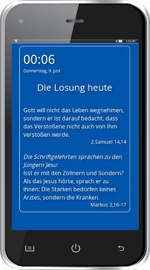

## Losungen Light
A simple HTML5 app displaying the "Losungen 2016" with the focus on mobile devices like Smartphone, Tablet. Mobile first. 
To be deployed locally on your htdocs folder. A web deployment is prepared.



"Losungen 2016" is a collection of daily bible verses for prayer and spiritual inspiration. Available primarily as book. Besides an app they offer an XML file containing these verses yearly for free download. This is what I used here. I wanted a lean solution on my Smartphone, no app.

### Basic requirements
 - Apache

### Dev requirements
 - NPM
 - Apache
 - git

### Basic functions
jQuery is fetching the "Losungen 2016" as XML file (under data/ ) and placing the verses to specific DOM nodes.

### Third party
I used "simpleClock" *(see license.md)* to drive the four-digit clock/date and placed it on top/left

### Install
```
cd /var/www/html
mkdir losungen
cd losungen
git clone https://github.com/hroesser/Losungen-Light.git . 
```
Surely you can just d/l the zip, unzip and deploy.

Then point your browser to:
```
http://localhost/losungen/
```
or
```
http://127.0.0.1/losungen/
```
If you want to develop on the Losungen:

### Development
For the purpose you want to fork and develop or design your own solution, I prepared an environment with Grunt.
My gruntfile defines a buildprocess with *jshint, uglify* for JS, *cssmin* for CSS since that would make sense here. You can easily start from that.
 - no reason for LESS. my CSS is lean
 - *simpleClock.js* already minified but perhaps you want to develop on it

